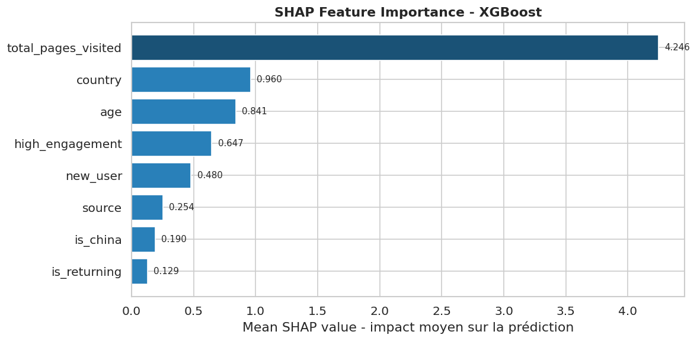
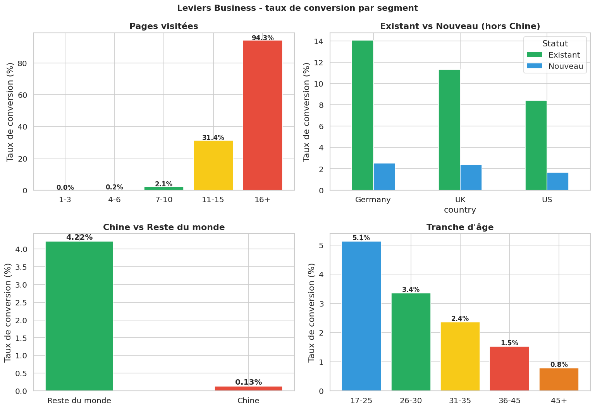
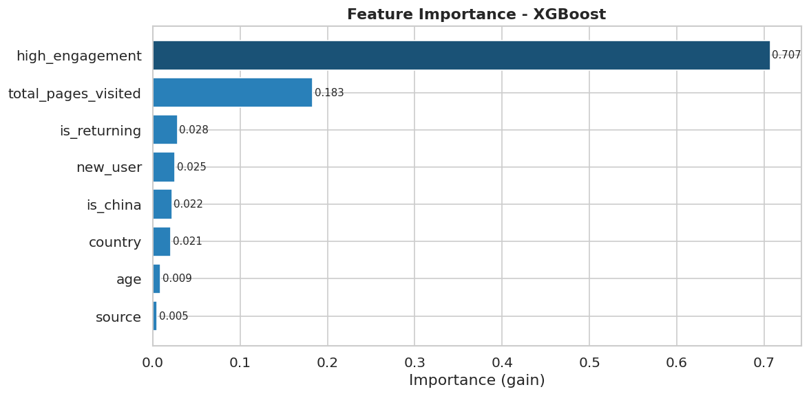

# **Projet Conversion Rate - Bloc 3 (Supervised ML)**

Projet de machine learning supervisé réalisé dans le cadre de la certification **CDSD - JEDHA (Bloc 3)**.  
Le projet suit un format de challenge type Kaggle autour de la prédiction de conversion utilisateur (inscription newsletter).

## **A propos du projet**

Le dataset provient d'un cas d'usage "marketing analytics" :
- une table d'entraînement `data_train.csv` avec cible `converted`
- une table de test `data_test.csv` sans cible

Le but est de construire un modèle capable de prédire la probabilité de conversion d'un visiteur à partir de variables comportementales et contextuelles (`country`, `age`, `new_user`, `source`, `total_pages_visited`).

## **Objectif**

- Maximiser la performance de classification sur la métrique **F1-score** (métrique officielle du challenge).
- Produire un fichier de soumission au format attendu.
- Interpréter les facteurs de conversion pour proposer des leviers business actionnables.

## **Livrables attendus**

- Analyse exploratoire (EDA) avec visualisations pertinentes.
- Pipeline de preprocessing + entraînement de modèles supervisés.
- Optimisation (hyperparamètres + seuil de décision).
- Fichier de prédictions pour soumission leaderboard.
- Analyse finale des variables importantes + recommandations métier.

## **Structure du projet & ordre d'exécution**

### **Arborescence principale**

- `data/` : fichiers source du challenge (`conversion_data_train.csv`, `conversion_data_test.csv`)
- `notebook/` : notebooks de travail organisés par étapes
- `outputs/data/` : fichiers de prédiction (soumissions)
- `outputs/models/` : modèles sérialisés (`.pkl`)
- `outputs/images/` : figures générées (EDA, performance, interprétation)
- `pyproject.toml` / `uv.lock` : gestion des dépendances

### **Ordre d'exécution recommandé**

1. `notebook/00_conversion_rate_challenge_description.ipynb` (contexte du challenge)
2. `notebook/01_data_exploration_eda.ipynb` (EDA et insights)
3. `notebook/02_feature_engineering.ipynb` (features + preprocessing)
4. `notebook/03_training_tuning.ipynb` (entraînement, tuning, seuil)
5. `notebook/04_submission_inference.ipynb` (inférence + export de soumission)
6. `notebook/05_interpretation_recommendation.ipynb` (interprétation business)

## **Stack technique & prérequis**

### **Environnement**

- Python `>= 3.12`
- Gestionnaire recommandé : `uv`

### **Librairies principales**

- `pandas`, `scikit-learn`, `xgboost`, `lightgbm`
- `matplotlib`, `seaborn`, `plotly`
- `shap`
- `joblib`

## **Installation & configuration**

### **Option 1 (recommandée) - avec uv**

```bash
uv sync
uv run jupyter lab # ou lancer le notebook
```

### **Option 2 - avec pip**

```bash
python -m venv .venv
source .venv/bin/activate
pip install -U pip
pip install -e .
jupyter lab # ou lancer le notebook 
```

### **Paramètres pratiques**

- Vérifier que le kernel Jupyter pointe vers l'environnement du projet.
- Exécuter les notebooks dans l'ordre indiqué pour garantir la cohérence des outputs.

## **Interprétation finale & recommandations**

Les analyses finales sont disponibles dans `notebook/05_interpretation_recommendation.ipynb`.

### **Visuels de synthèse**





### **Recommandations business (synthèse)**

- **Augmenter `total_pages_visited`** via des parcours de navigation plus guidés (CTA progressifs, contenu recommandé, pagination optimisée).
- **Cibler les segments à forte propension** (`source`, `country`, `new_user`) avec des messages d'acquisition et d'onboarding différenciés.
- **Adapter le timing de conversion** pour les nouveaux utilisateurs (incitations contextualisées après quelques interactions clés).
- **Piloter par seuil opérationnel** : choisir le seuil de décision selon le compromis précision/rappel attendu par l'équipe marketing.

## **Auteur & Contexte**

- Auteur : **RANJAKASOA Raphaël Marcellin**
- Contexte : **Projet de certification JEDHA - Bloc 3 (Supervised Machine Learning)**
- Type : challenge de prédiction de conversion avec rendu leaderboard + interprétation métier.
